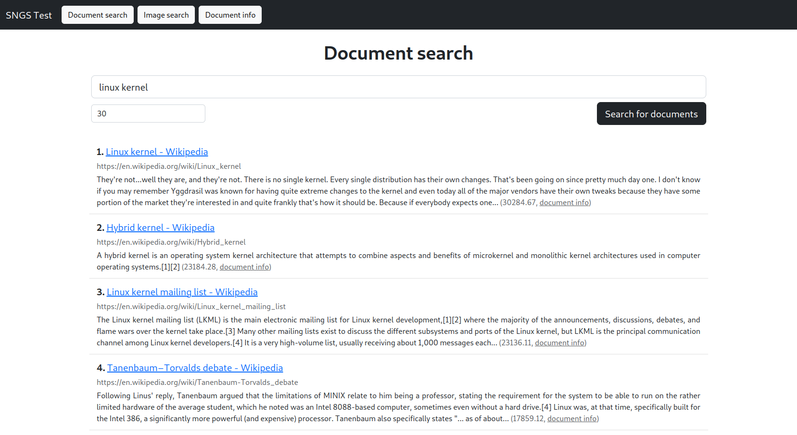
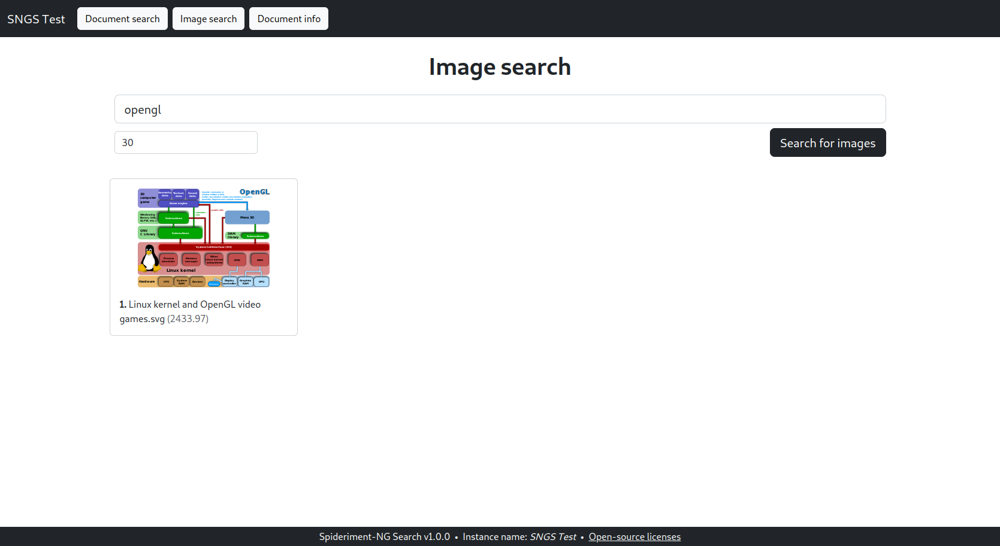
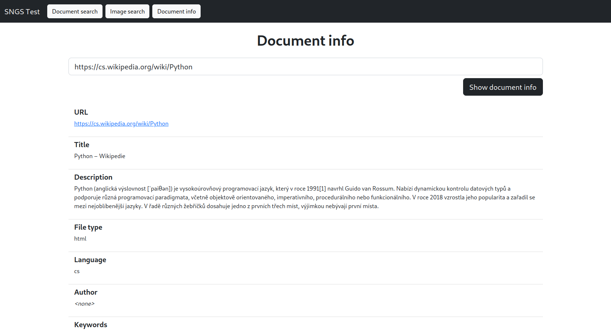

# Spideriment-NG Search

**Spideriment-NG Search** _(spider + experiment "Next Generation" Search)_ is a **web search engine** which makes use of
a web index created by the **[Spideriment-NG web crawling daemon](https://github.com/vitlabuda/spideriment-ng)** to 
perform searches.

It is a Python / Flask web application which is able to perform **document searches**, **image searches** and can query 
for **information about a crawled document**, while offering two frontends: an **HTML web interface** 
([screenshots below](#web-interface--screenshots)) and a **JSON API** ([examples here](api_examples)). 
Architecture-wise, the app's backend is object-oriented, follows the MVC (Model-View-Controller) design approach and 
makes use of Dependency Injection ([`sidein`](https://github.com/vitlabuda/sidein)). The web interface frontend is 
responsive and mobile-friendly, as it is styled using the Bootstrap library.

The search algorithm is not part of the program; instead, the searches are carried out by the configured database 
driver. This means that the whole index does not have to be transferred to this app each time a search is performed 
(which would make the app unbearably slow), and can stay in the database if it is able to search for and rank the 
results itself. The `mysql` database driver, which is currently the only one driver supported by both the crawling 
daemon and this app, makes use of the RDBMS's built-in fulltext search capabilities (`MATCH() AGAINST()`) in companion 
with configuration-provided _scoring multipliers_.


## Web interface – screenshots

<a href="screenshots/001_document-search.png"></a>
<a href="screenshots/002_image-search.png"></a>
<a href="screenshots/003_document-info.png"></a>


## Deployment

### Docker

The necessary files and documentation related to deploying this app using Docker are in the
**[spideriment-ng-docker](https://github.com/vitlabuda/spideriment-ng-docker)** repository.


### Linux – Flask's built-in development server
The program requires **Python 3.9 or above**.

#### 1. Install the dependencies
Using `apt` (Debian, Ubuntu etc.):
```shell
sudo apt update
sudo apt install python3 python3-pip python3-virtualenv virtualenv
```

Using `dnf` (Fedora, CentOS, RHEL etc.):
```shell
sudo dnf install python3 python3-pip python3-virtualenv virtualenv
```

#### 2. Configure the app
```shell
cd src/
cp spideriment-ng-search.example.toml spideriment-ng-search.toml
nano spideriment-ng-search.toml  # Use the editor you prefer...
```
You can find an example configuration of this app in the 
[`spideriment-ng-search.example.toml`](src/spideriment-ng-search.example.toml) file.

#### 3. Initialize the app's virtual environment
```shell
cd src/
./initialize_virtualenv.sh
```

#### 4. Run the app (using Flask's built-in development server)
Assuming you are running `bash`:
```shell
cd src/
. __venv__/bin/activate
__venv__/bin/python3 ./spideriment_ng_search/spideriment_ng_search.py
```
By default, the configuration file on path [`src/spideriment-ng-search.toml`](src/spideriment-ng-search.toml) is used. 
If you wish to use a different one, you may specify its path into the `SNGS_CONFIG_FILE_PATH` environment variable.

#### 5. Stop the app
To stop the app, press **Ctrl+C** in the terminal it is running in.


## Licensing
This project is licensed under the **3-clause BSD license** – see the [LICENSE](LICENSE) file.

In addition, this project uses some third-party open-source components – see the 
[BACKEND-THIRD-PARTY-LICENSES](BACKEND-THIRD-PARTY-LICENSES) and the
[FRONTEND-THIRD-PARTY-LICENSES](FRONTEND-THIRD-PARTY-LICENSES) file.

Programmed by **[Vít Labuda](https://vitlabuda.cz/)**.
